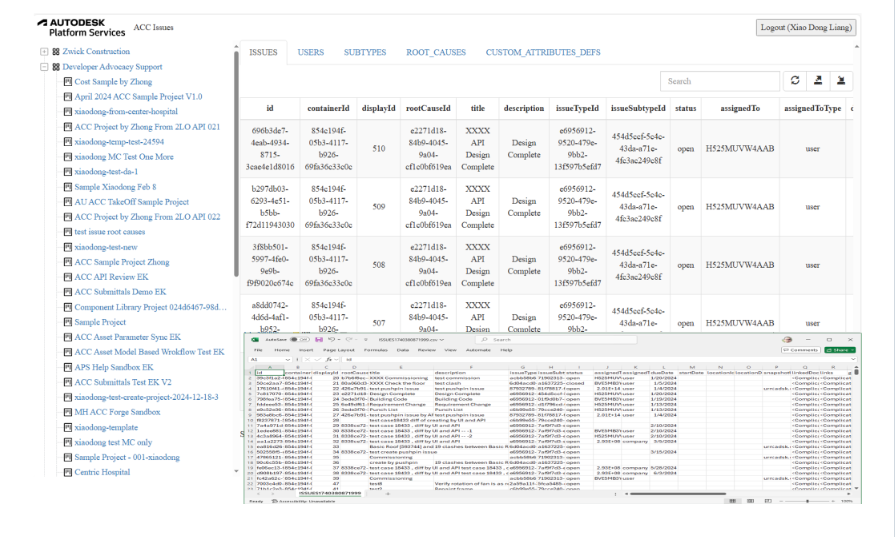

# ACC Issue API Tutorial (Node.js)


[](https://nodejs.org)
[](https://www.npmjs.com/)
[](https://opensource.org/licenses/MIT)

[](https://forge.autodesk.com/en/docs/acc/v1/overview/field-guide/issues/)

[Autodesk Platform Services](https://aps.autodesk.com) application built by following
the [ACC Issue](https://tutorials.autodesk.io/tutorials/acc-issue/) tutorial
from https://get-started.aps.autodesk.com/.

## Description
APS application that allows the authenticated user in [Autodesk Construction Cloud](https://www.autodesk.com/products/autodesk-docs/overview) to extract project issues and issues settings: sub types, root causes, custom attribute of a 
given ACC project. This application renders these data in a tabular view. The data can also be exported to CSV
file easily. With the data from a CSV, the application demos the scenario that imports them to create new issues or modify the existing issues.



## Development

### Prerequisites

- [APS credentials](https://aps.autodesk.com/en/docs/oauth/v2/tutorials/create-app)
- [Autodesk Construction Cloud](https://fieldofviewblog.wordpress.com/2017/08/31/bim-360-acc-account-for-development/)
- Provisioned access to [Autodesk Construction Cloud](https://get-started.aps.autodesk.io/#provision-access-in-other-products)
- [Node.js](https://nodejs.org) (Long Term Support version is recommended)
- Command-line terminal such as [PowerShell](https://learn.microsoft.com/en-us/powershell/scripting/overview)
or [bash](https://en.wikipedia.org/wiki/Bash_(Unix_shell)) (should already be available on your system)
- Prepare a [Project of Autodesk Construction Cloud with Issue Module Activated](https://help.autodesk.com/view/BUILD/ENU/?guid=Issues_About). Create some demo issues manually.
> We recommend using [Visual Studio Code](https://code.visualstudio.com) which, among other benefits,
> provides an [integrated terminal](https://code.visualstudio.com/docs/terminal/basics) as well.


### Setup & Run

- Clone this repository: `git clone https://github.com/autodesk-platform-services/aps-acc-issues-tutorial-nodejs`
- Go to the project folder: `cd aps-acc-issues-tutorial-nodejs`
- Install Node.js dependencies: `npm install`
- Open the project folder in a code editor of your choice
- Create a _.env_ file in the project folder, and populate it with the snippet below,
replacing `<client-id>` and `<client-secret>` with your APS Client ID and Client Secret,
and `<secret-phrase>` with an arbitrary string:

```bash
APS_CLIENT_ID="<client-id>"
APS_CLIENT_SECRET="<client-secret>"
APS_CALLBACK_URL="http://localhost:8080/api/auth/callback" # URL your users will be redirected to after logging in with their Autodesk account
SERVER_SESSION_SECRET="<secret-phrase>" # phrase used to encrypt/decrypt server session cookies
```

> For applications deployed to a custom domain, the callback URL will be `http://<your-domain>/api/auth/callback`
> or `https://<your-domain>/api/auth/callback`. Do not forget to update the callback URL for your application
> in https://aps.autodesk.com/myapps as well.

- Run the application, either from your code editor, or by running `npm start` in terminal
- Open http://localhost:8080

> When using [Visual Studio Code](https://code.visualstudio.com), you can run & debug
> the application by pressing `F5`.

## Main Functionalities

- Export Issue Records: The application can extract all issues data from a project and render them in a table view. It also allows the user to save as the data to a csv file
 1. login with a valid user of this ACC project.
 2. in the left tree panel, nagivate to the project to inspect
 3. click this project, the application will start to dump the issue data. Finally it renders the data in the table view. By default, the rows are sorted by **displayId**. The complicated objects (array, json, json array) will be converted to string
 4. It also extracts the records of **Issue SubTypes**, **Root Causes** and **Custom Attributes Definitions** of this project.
 5. click the toolbar button of table view, the issues view can be saved to a csv file. Because it is hard to manage the complicated objects (array, json, json array) in csv, they will be hard-coded with the string '<Complicated Objects>'. 

- Import Records from CSV to Create or Modify Issues: The application allows the user to import a csv file, with that it creates the new issue or modify the existing issues.
 1. login with a valid user of this ACC project.
 2. in the left tree panel, nagivate to the project to inspect
 3. click this project, the application will start to dump the issue data. Finally it renders the data in the table view.
 4. ensure the issue tab is activated, click the toolbar button of table view, it will ask to select a csv file. Then process the records accordingly. Finally, the table view will be refreshed with the updated issues.
    
    > It is strongly recommended to use the same pattern of the csv that is exported in the previous function (__Export Issue Records__). 

    > To add new issue, leave the column **id** empty

    > To modify the existing issue, keep the column **id** with the issue id, update other fields with new values.

    > A few fields are required when working with creating issues(POST). A few fields are supported when working with modifying issues (PATCH). Please check API references for more details.     > to make it clearer, this application narrow down with [some supported fields](https://github.com/xiaodongliang/aps-acc-issues-tutorial-nodejs/blob/main/wwwroot/table.js#L6).

    > the row number of the records is not used with these scenarios, but will be used when tracking the status. 

    > the status of created/modified/failed are tracked and will be printed out in the browser console after the process. 

## Limitations
 - not all supported fields of creating issue or modifying issues are demoed
 - to read value of csv, each cell is parsed by comma (,) but if the value itself contains comma, it would cause problem. So you may need to design the code more deliberately with your requirement. 
 - values of complicated objects are not saved to csv. you could simplify the object to individual values for working with csv.
 - the info of the logged user is not shown up. you could use GET: User/Me to fetch it
 - rate limit
 
## Troubleshooting

Please contact us via https://aps.autodesk.com/en/support/get-help.

## License

This sample is licensed under the terms of the [MIT License](http://opensource.org/licenses/MIT).
Please see the [LICENSE](LICENSE) file for more details.
